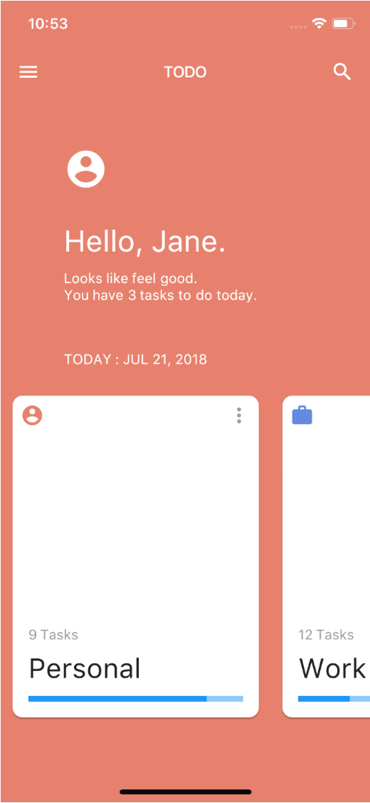

# Flutter UI Challenge Week 3

아래 스크린샷처럼 UI를 각자의 이름 폴더으로(joshua, odin, amber) 작성해서 업로드 해주세요.

1. 하단 목록을 뷰페이저 형태로 구현해주세요.
2. 스와이프 이벤트에 대한 처리를 자유롭게 표현 해주세요.
  ex) 메인배경색상이 변경, 본문(Hello, Jane. ...) 내용이 변경, 토스트 등

## ** 전체적인 구성을 어떻게 할지를 목표로 두고 세부적인 UI를 똑같이 할려고 노력하지 않아도 됩니다. **
